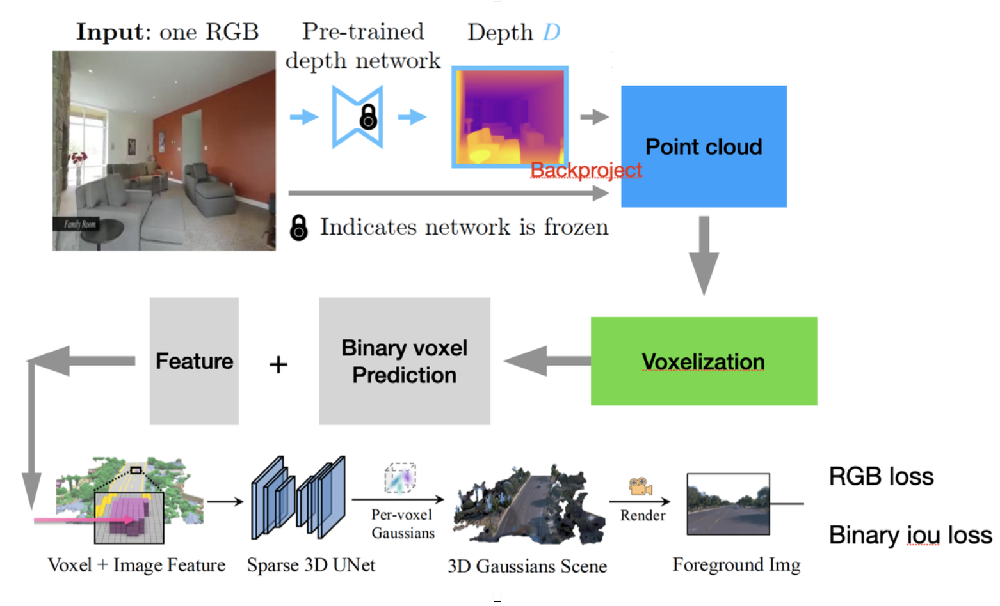

# Voxel-GaussianAnything

**Voxel-GaussianAnything** is a research project for **generalizable 3D Gaussian Splatting and novel view synthesis from single-view monocular images, without diffusion models**.

---
## Method Overview


---

## Key Features

- Uses **Microsoft Moge** monocular depth estimation + **DINO v2 ViT** to extract 3D feature point clouds.  
- **Voxelization** of feature point cloud with predicted binary voxel occupancy.  
- Employs a **Voxel Transformer** for voxel feature completion.  
- Generates **3D Gaussian features** and renders them for novel view synthesis.  
- Training includes both **RGB loss** and **ground-truth binary voxel supervision** to enforce 2D/3D consistency.  

---

## Getting Started

### 1. Clone the Repository
```bash
git clone https://github.com/zifeiyuu/GaussianAnything.git
cd GaussianAnything
```

### 2. Setup Environment
```bash
conda create -n voxel-ga python=3.10
conda activate voxel-ga
pip install -r requirements.txt
```

### 3. Train & Evaluate
```bash
bash train_torch.sh
bash evaluate.sh
```
---

## License
MIT License © 2025 [zifeiyuu](https://github.com/zifeiyuu)
